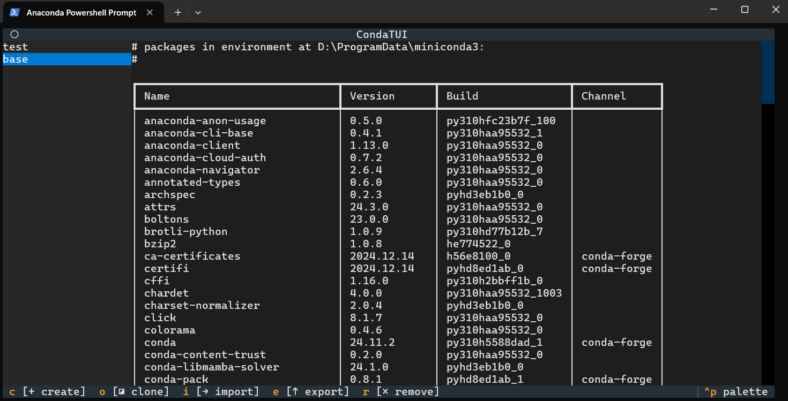

# conda-tui

#### 介绍
conda是常用的Python环境管理工具，但conda相关命令冗长繁多、难以记忆，导致很多用户常常遗忘命令的写法，处于一种“边查边用”的状态，降低了工作效率。

Anaconda公司虽然推出了GUI工具Anaconda Navigator，使用户能够以图形化方式管理conda环境，但Anaconda Navigator启动速度慢、运行速度慢，用户体验较差。

本项目提供了Anaconda Navigator核心功能的TUI实现，软件完全在终端中运行，与Anaconda Navigator相比速度有明显提升，同时还可以在没有图形环境的系统中使用。软件界面与Anaconda Navigator中“Environments”选项卡的内容相似，操作便捷，易于上手。本项目兼容Windows、Linux和Mac系统，为不同平台的用户提供了一致的用户体验。

#### 软件架构
使用Python中的[textual库](https://textual.textualize.io/)开发TUI应用

#### 安装教程

1.  克隆本仓库，或下载zip压缩包并解压
2.  打开一个带有Python环境的命令行终端，进入到本项目所在文件夹内，运行`python .\install.py`。
3.  重启终端，在终端中输入`condat`即可启动软件。

